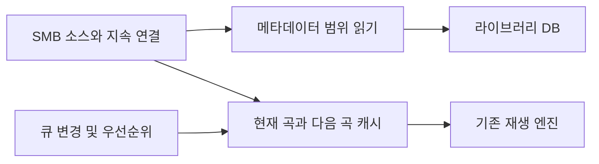

# Resonance 직접 SMB 접근 구현 계획

_2026-10-05 · 다음 세션 구현을 위한 설계 및 작업 인계 · 상태: 계획 확정 전 기술 검증 필요, 기존 fallback 초안 있음_

---

## 🎯 목표와 필수 제약

고정된 Aurender 서버의 음악 라이브러리를 macOS에 마운트하지 않고 앱에서 직접 열람한다. **스캔은 태그에 필요한 구간만 읽고**, 재생은 현재 곡과 다음 곡의 로컬 캐시를 이용한다. 이번 세션에서는 계획만 저장하며, 아래 코드 변경과 실서버 검증은 다음 세션에서 진행한다.

- 스캔 과정에서 음원 전체를 다운로드하거나 오디오 프레임 전체를 순회하지 않는다. 지원하지 않는 형식도 전체 다운로드로 조용히 우회하지 않는다.
- 현재 곡이 재생되는 동안 다음 곡을 미리 받는다. 다음 곡 다운로드 때문에 현재 곡의 재생 시작을 지연시키지 않는다.
- 기존 로컬 라이브러리, 트랙 ID, 즐겨찾기, 큐, 앨범 설명과 작품 연결을 보존한다.
- 서버의 원본 파일을 수정하거나 이름을 변경하지 않는다.
- 직접 SMB 연결은 macOS의 마운트 계층을 우회하는 것이다. 운영체제의 네트워크 스택과 앱 네트워크 권한은 계속 적용된다.
- 기존 작업 디렉터리에 여러 기능의 미커밋 변경이 있으므로, 다음 세션 시작 시 변경 범위를 확인하고 보존한다.

## 📋 관찰된 사실과 아직 모르는 점

아래는 앞선 조사에서 확인한 결과다. 새 세션에서는 임시 파일과 서버 상태가 유지되어 있는지 다시 확인한다.

| 항목 | 확인된 결과 | 해석의 한계 |
| --- | --- | --- |
| 서버 | `192.168.0.11`, 공유 `Music1`, `Music2`, 사용자 `aurender` | 제품 코드에 고정하지 않고 소스 설정에 저장 |
| 마운트 경로 | `/Volumes/Music1`, `/Volumes/Music2` | 직접 SMB 소스의 식별자로 사용하지 않음 |
| 일부 FLAC 접근 | 마운트에서 목록/속성 조회가 되지만 실제 열기는 `ENOENT` | 파일이 삭제됐다는 뜻으로 단정할 수 없음 |
| 문제 앨범 검사 | 두 앨범의 24개 FLAC 중 20개는 마운트에서 읽힘, 4개는 실패 | 실서버 목록은 새 세션에서 재확인 |
| 직접 SMB | Kaku의 인증된 `smbclient`에서 `Music2` 문제 파일 한 개 다운로드 성공 | 다른 라이브러리의 호환성까지 입증한 것은 아님 |
| 파일 검증 | 내려받은 FLAC의 `flac --test --silent` 성공 | 앱의 실제 직접 SMB 재생은 미검증 |
| 다운로드 표본 | 7,830,940 bytes, smbclient 표시 약 9,984 KiB/s | 한 번의 표본이며 마운트 방식과의 공정한 속도 비교가 아님 |
| 명령행 설정 | `-s /dev/null`로 기본 설정 파일 누락 경고 우회 후 연결 성공 | 경고 자체가 인증/연결 실패를 의미하지 않음 |

문제 파일은 `Lawrence Power/Viola & Piano`의 02번과 05번, `Various/Symphonies of Wind Instruments`의 일부 Hindemith 트랙이다. 악센트 문자·조합형 문자·BOM 등이 관찰되었으나 **정확한 실패 원인은 확정하지 않았다**. 같은 폴더의 특수문자 파일 중 정상적으로 열리는 파일도 있었다. NFC/NFD 변환만으로 해결됐다고 간주하지 않는다.

Codex 측 프로세스의 직접 접속은 `HOST_UNREACHABLE`로 실패했지만 Kaku에서는 연결됐다. 앱별 로컬 네트워크 설정 차이도 관찰되었으나 인과관계는 미확정이다. 다음 세션은 실제 Resonance 프로세스에서 접속을 확인한다. 시스템 개인정보 설정은 앞선 조사에서 변경하지 않았다.

### 태그 부분 읽기 가능성을 확인한 표본

이미 다운로드한 위 FLAC을 로컬에서 파싱한 결과다. SMB 부분 읽기의 실제 전송량을 측정한 결과는 아니다.

| 블록 | 본문 길이 |
| --- | ---: |
| STREAMINFO | 34 bytes |
| SEEKTABLE | 216 bytes |
| VORBIS_COMMENT | 745 bytes |
| PADDING | 4,096 bytes |

메타데이터는 파일 시작부터 5,111 bytes까지다. 시그니처·블록 헤더·STREAMINFO·VORBIS_COMMENT만 선택하면 논리적으로 필요한 데이터는 799 bytes다. 네트워크 요청 수와 버퍼 정책에 따라 실제 읽기량은 달라진다. 이 표본의 수치를 모든 파일에 적용하지 않는다. 큰 내장 커버가 있는 파일은 메타데이터 자체가 클 수 있다.

## 🏗️ 설계 방향

### 전송 계층 선택

`smbclient` CLI의 파일 단위 `get`을 스캔 엔진으로 사용하지 않는다.[^1] **지속 연결과 offset/count 읽기를 제공하는 SMB 라이브러리**를 Swift에서 사용한다. 우선 후보는 `libsmb2`이며 `smb2_pread`/비동기 API를 확인한다.[^2] 아직 라이브러리 선택·Swift 연결·앱 번들 동봉을 검증한 상태는 아니다.

첫 단계에서 문제가 있던 정확한 파일명을 라이브러리로 열 수 있는지 검증한다. 실패하면 Samba 계열 `libsmbclient`의 seek/read 접근을 대안으로 조사한다. CLI에서 성공했다는 이유로 `libsmb2`에서도 동일하게 성공한다고 가정하지 않는다. API 문서는 Context7을 우선 확인하고, 제공되지 않으면 선택한 버전의 공식 헤더와 소스를 근거로 구현한다.

### 스캔과 재생 경로 분리

공유별 연결을 재사용하되 라이브러리의 스레드 안전성에 맞춰 actor 또는 직렬 실행기로 관리한다. 스캔이 재생 다운로드를 막지 않도록 작업 우선순위 또는 제한된 별도 연결을 둔다. 무제한 병렬 요청과 파일마다 새 CLI 프로세스를 만드는 방식은 피한다.

### 소스 모델과 파일명

- 로컬 소스와 SMB 소스를 구분하는 모델을 도입한다. SMB에는 안정적인 source ID, 서버, 공유명, 공유 내부 루트, credential 참조를 저장한다.
- 예: 기존 `/Volumes/Music2/[Classic]/Artist`는 서버 `192.168.0.11`, 공유 `Music2`, 내부 루트 `[Classic]/Artist`로 대응한다. 실제 등록 루트와 DB를 먼저 확인한다.
- 직접 SMB 열거·stat·read 경로는 `/Volumes` 존재 여부나 volume UUID에 의존하지 않는다.
- 서버에서 반환한 경로 구성요소를 보존한다. 화면 표시/검색용 정규화와 실제 원격 경로를 분리한다.
- Swift `String`의 정규화 동등성으로 서로 다른 서버 항목을 합치지 않도록 경로 키와 원본 인코딩의 보존 방식을 검증한다.
- 구분자, 상위 경로 탈출, 제어문자 처리는 라이브러리 API와 서버 경로 의미에 맞춘다. 전각 문자나 악센트를 임의로 치환하지 않는다.

## 📚 메타데이터 스캔

### FLAC부터 완성

FLAC은 오디오 프레임 앞에 메타데이터 블록이 있고, 블록 헤더에서 종류·길이·마지막 블록 여부를 알 수 있다.[^3] 이를 이용해 필요한 본문만 읽는다.

1. 공통 범위 읽기 인터페이스를 정의한다: 파일 크기, `read(offset, count)`, 취소, 제한 시간, 짧은 읽기/EOF 처리.
2. FLAC 시그니처와 각 블록 헤더를 읽고 길이·경계·정수 오버플로를 검증한다.
3. STREAMINFO에서 샘플레이트·비트 깊이·채널·총 샘플 수를 읽고, VORBIS_COMMENT에서 기존 태그 매핑에 필요한 필드를 추출한다.
4. SEEKTABLE, PADDING, PICTURE 등 불필요한 본문은 다음 오프셋으로 건너뛴다. 오디오 프레임에 진입하지 않는다.
5. 커버는 별도 요청으로 앨범 단위 지연 로딩한다. 태그 스캔의 커버 다운로드는 기본적으로 생략한다.
6. 총 샘플 수 등 정보가 없으면 길이를 미상으로 보존한다. 정확한 길이를 구하려고 전체 오디오를 읽지 않는다.

메타데이터 본문 크기·블록 개수·총 읽기량에 상한을 두고, 초과 시 이유가 있는 부분 결과/오류로 남긴다. 버퍼를 미리 읽는 경우에도 FLAC 오디오 영역을 불필요하게 가져오지 않도록 블록 경계를 반영한다. 요청 단위 오버헤드는 측정 후 최적화한다.

### 다른 형식과 증분 스캔

실제 라이브러리의 확장자 분포를 먼저 조사하고 MP3/ID3, MP4/M4A, AIFF 등 지원 우선순위를 정한다. 앞부분 고정 길이만 읽으면 모든 형식의 태그를 얻는다고 가정하지 않는다. 끝부분 태그나 컨테이너 메타데이터도 bounded seek/read로 처리해야 한다.

1차 FLAC 구현 이후에도 다른 형식의 **전체 다운로드 스캔은 금지**한다. 미지원 형식은 이름·크기 등 기본 항목과 지원 상태를 저장하고 태그를 보류한다. 로컬 파일의 기존 메타데이터 읽기는 유지한다.

원격 크기·수정 시각 등 이용 가능한 식별 정보를 저장해 변경되지 않은 파일은 다시 읽지 않는다. 연결 끊김이나 일부 디렉터리 실패는 스캔 미완료로 처리하고 기존 트랙을 삭제하지 않는다. 정상적으로 열거가 끝난 범위에 대해서만 기존 reconciliation 정책을 적용한다.

## 🎵 재생 캐시와 다음 곡 준비

첫 구현에서는 현재 곡을 로컬 캐시에 완전히 받은 뒤 기존 재생 엔진에 URL을 전달한다. 첫 재생과 캐시되지 않은 임의 곡 선택에는 다운로드 대기가 있을 수 있다. 부분 다운로드 중 재생하는 별도 스트리밍 디코더는 이후 범위로 둔다.

- 현재 곡 준비를 최우선으로 처리하고, 재생 시작 후 다음 곡을 비동기로 준비한다. 초기 목표는 다음 1곡이며, 측정 결과에 따라 2–3곡 또는 재생시간 기반으로 확대한다.
- 현재 초안의 `prepare` → `await prepareNext` → 재생 시작 순서를 점검한다. 다음 곡 준비를 기다린 뒤 현재 곡을 재생하는 순서는 바꿔야 한다.
- 큐 이동·삭제·셔플·다음 곡 건너뛰기 시 generation으로 오래된 결과를 버린다. 이미 공유 중인 다운로드의 다른 사용자를 취소하지 않는다.
- 캐시 키에 소스 ID·정확한 원격 경로·파일 버전을 포함한다. 원격 파일이 다운로드 중 바뀌는 경우를 감지한다.
- 임시 파일에 기록하고 크기/완료 상태를 확인한 뒤 원자적으로 공개한다. 헤더 파싱 성공을 전체 오디오 무결성 검사 성공과 동일시하지 않는다.
- 현재/다음 곡은 lease로 고정하고 나머지는 용량 제한 내에서 정리한다. 기존 초안의 4 GiB는 임시 기본값이며 여유 디스크와 큰 파일을 고려한다.
- 앱 재시작 시 오래된 `.partial` 정리, 다운로드 공간 예약 해제, 재사용 캐시 검증을 처리한다.
- 기존 AVQueuePlayer 및 AirPlay 경로를 유지하면서 곡 전환, seek, 정지, 출력 변경을 회귀 검증한다.

## 🔧 현재 초안 인계와 수정 지점

아래는 작업 디렉터리에 있는 **미완성 초안**이다. 직접 SMB 소스 구현 완료나 설치된 앱의 기능으로 간주하지 않는다. 다음 세션에서 최신 diff를 다시 확인한다.

| 파일 | 현재 역할 | 다음 변경 |
| --- | --- | --- |
| `Sources/ResonanceCore/SMB/SMBConnection.swift` | 마운트와 연결 설정 대응 | 마운트 독립 소스 모델 |
| `Sources/ResonanceCore/SMB/SMBClient.swift` | CLI 파일 다운로드 | 라이브러리 기반 열거·범위 읽기 |
| `Sources/ResonanceCore/SMB/AudioFileAccess.swift` | native-first, ENOENT 시 전체 파일 캐시 | 재생 전용 캐시로 역할 제한 |
| `Sources/ResonanceCore/Library/LibraryScanner.swift` | 위 resolver로 메타데이터 읽기 | 태그 범위 읽기로 교체 |
| `Sources/Resonance/Playback/PlaybackCoordinator.swift` | 현재/다음 곡 lease | 재생 우선, 비동기 prefetch, 취소 |
| `Sources/Resonance/Stores/AppModel.swift` | 공유 resolver와 설정 주입 | 소스·스캔·재생 계층 연결 |
| `Sources/Resonance/Views/SMBFallbackSettingsView.swift` | 마운트 기반 fallback 설정 | 직접 SMB 소스 추가/연결 상태 |
| `Sources/Resonance/Support/SMBFallbackDiagnostic.swift` | 임시 DB 진단 도구 | 범위 읽기량과 직접 소스 검사 |
| `Tests/ResonanceCoreTests/SMBFallbackTests.swift` | 캐시·취소·CLI 보안 mock 테스트 | 새 transport와 부분 읽기 테스트 |

현재 스캐너는 fallback resolver를 통해 문제 파일 전체를 받는다. 이는 최종 요구와 충돌하므로 **이 상태로 배포하지 않는다**. 또한 마운트의 파일 속성 조회에서 먼저 실패하면 fallback에 도달하지 못하는 경로도 점검한다.

캐시 초안에서는 임시 디렉터리 생성 실패 시 예약 해제, 오래된 partial 정리, 공유 작업의 개별 취소, 종료되지 않는 자식 프로세스 처리를 재검토한다. CLI를 제거한다면 해당 프로세스 제어 코드를 그대로 확장하지 않는다.

앞선 세션에서 `./script/test.sh --filter SMBFallbackTests`의 7개 테스트가 통과했다. 이는 주입된 가짜 다운로드에 대한 결과이며, 실제 서버·직접 태그 읽기·패키징된 앱을 검증한 것이 아니다. 마지막 번들 빌드의 최종 성공 여부와 설치 상태는 다음 세션에서 다시 확인한다. SMB 자격증명은 앱 설정에 저장되지 않았고, 진단 도구도 실서버 검증을 마치지 않았다.

앨범의 선택/큐 버튼을 곡 목록 바로 위로 옮기는 UI 변경은 별도 작업이다. `AlbumDetailView.swift`와 `TrackSelectionBar.swift`의 변경을 SMB 작업 중 되돌리지 않는다.

## 🔐 데이터 보존과 배포

### 기존 라이브러리 이관

DB 변경 전 일관된 백업을 만들고 migration을 transaction으로 수행한다. 기존 root ID를 유지하며 그 루트의 접근 방식을 SMB로 대응시킨다. 단순히 새 소스를 추가해 같은 곡을 다시 등록하지 않는다.

트랙/앨범 ID와 연결된 즐겨찾기, 큐, 작품 연결, 설명을 전후 비교한다. 파일명 정규화나 경로 표현 변경으로 ID가 달라질 수 있는지 먼저 확인한다. 기존 마운트 기반 접근으로 되돌리는 경우에도 같은 데이터가 남아야 한다. 스캔 실패를 삭제로 해석하지 않는 기존 보존 규칙을 유지한다.

### 자격증명과 앱 번들

비밀번호는 이 문서에 기록하지 않는다. 다음 세션에서 필요하면 앱의 SecureField로 입력받아 Keychain에 저장한다. 대화의 평문 비밀번호를 소스·문서·로그·명령 인자·테스트 fixture에 복사하지 않는다.

선택 라이브러리의 라이선스와 배포 조건, 버전 고정, SwiftPM 연결, 아키텍처, 동적 라이브러리 경로, 서명 순서를 확인한다. 설치 앱은 Terminal PATH나 Homebrew에 의존하지 않도록 번들에서 종속성을 해결한다. Finder 미마운트 및 제한된 PATH에서도 동작을 검증한다. 문제 우회를 위해 SMB1 등 보안 설정을 자동으로 낮추지 않는다.

## 🧪 구현 순서와 완료 기준

| 단계 | 작업 | 완료 증거 |
| --- | --- | --- |
| 1 | 최신 Git/DB 구조 확인, transport 후보 검증 | 문제 파일 열기 및 임의 범위 읽기 성공 |
| 2 | FLAC 범위 파서와 계측 | 동일 태그, 오디오 영역 읽기 없음 |
| 3 | SMB 열거와 안정적 source 모델 | 미마운트 상태에서 두 앨범 스캔 |
| 4 | DB migration과 증분 처리 | ID 보존, 중복 없음, 실패 시 기존 데이터 유지 |
| 5 | 재생 캐시/prefetch/UI | 현재 곡 즉시 시작 후 다음 곡 준비, 정상 전환 |
| 6 | 패키징 및 실앱 검증 | Finder 마운트와 Homebrew 없이 설치 앱 동작 |

### 필수 검증

- [ ] 문제 두 앨범을 다시 열거하고 정확한 원격 이름과 개수를 기록한다. 이전 표본은 24개였다.
- [ ] 실패했던 파일의 직접 열기와 FLAC 부분 읽기를 실제 앱 실행 환경에서 확인한다.
- [ ] mock range reader에서 모든 offset/count를 기록해 오디오 영역에 접근하면 테스트를 실패시킨다.
- [ ] 큰 PICTURE/PADDING, 잘린 파일, 잘못된 길이, EOF, 악센트/NFC/NFD 이름을 검사한다.
- [ ] 기존 로컬 태그 결과와 제목·작곡가·연주자·앨범·트랙 번호·기술 정보를 비교한다.
- [ ] 파일별 논리적 읽기량, 요청 횟수, 시간, 재시도와 스킵 이유를 기록한다. 실제 네트워크 전송량과 구분한다.
- [ ] 서버 단절·인증 실패·권한 부족·실제 파일 부재를 구분하고 무한 재시도하지 않는다.
- [ ] 부분 스캔 실패 후 기존 트랙이 사라지지 않으며, 반복 스캔에서 중복이 생기지 않는다.
- [ ] 큐 변경, 다음 곡 건너뛰기, 캐시 부족, 취소, 앱 재시작, 캐시 재사용을 검증한다.
- [ ] 마운트 방식과 속도를 비교한다면 같은 파일·조건에서 cold/warm을 분리한다. 단일 표본으로 우열을 주장하지 않는다.
- [ ] 단위 테스트, 관련 migration/재생 테스트, `git diff --check`, 번들 빌드를 마친다.
- [ ] 패키징된 앱에서 서버 접근·스캔·로컬 출력·AirPlay·곡 전환을 실제로 확인한다.

첫 배포의 핵심 통과 기준은 **미마운트 상태의 문제 FLAC을 전체 다운로드 없이 인덱싱하고, 재생 시에만 캐시에 받은 뒤 다음 곡을 미리 준비하는 것**이다. FLAC 외 지원 범위와 첫 곡 다운로드 대기 등 남은 제한은 결과 보고에 명시한다.

### 다음 세션 시작 지시문

> `docs/direct-smb-implementation-plan-2026-10-05.md`를 읽고 구현을 이어간다. 먼저 기존 미커밋 변경과 SMB fallback 초안을 확인해 보존한다. FLAC 메타데이터 스캔은 전체 음원 다운로드를 절대 사용하지 않는다. 첫 작업은 실제 문제 파일에 대한 SMB 라이브러리의 정확한 경로 열기와 offset/count 읽기 검증이다. 이후 안정적 소스/DB 이관, 재생 전용 캐시와 비동기 다음 곡 준비, 실앱 검증 순서로 진행한다.

## 🔗 참고 자료

다음 세션에서 선택한 라이브러리 버전에 맞춰 API와 배포 조건을 재확인한다.

[^1]: Samba, smbclient manual. `get`, 설정 파일, 인증 및 전송 옵션. https://www.samba.org/samba/docs/current/man-html/smbclient.1.html
[^2]: libsmb2 공식 저장소 및 공개 API 헤더. https://github.com/sahlberg/libsmb2 · https://github.com/sahlberg/libsmb2/blob/master/include/smb2/libsmb2.h
[^3]: IETF RFC 9639, FLAC format, 메타데이터 및 블록 구조. https://www.rfc-editor.org/rfc/rfc9639.html
