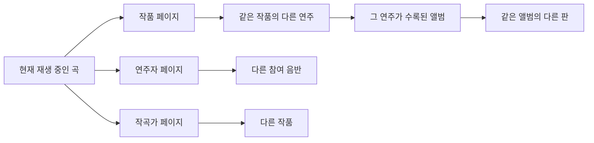

# Vespertine 메타데이터·탐색 구조와 Resonance 확장 제안

2026-10-03. 연결된 두 프로젝트의 현재 소스를 비교한 조사다. Vespertine의 실행 화면이나 실제 외부 API 매칭 결과를 검증한 기록은 아니다. 이 문서만 추가했으며 앱 구현은 변경하지 않았다.

**판단: Vespertine에서 가져올 핵심은 메타데이터 보완 절차와 탐색의 연속성이다. Resonance는 이미 작품·녹음·인물 관계를 갖고 있어서, 이를 활용한 감상 기능을 발전시킬 여지가 크다.**

**Vespertine은 정보를 어떻게 얻는가**

| 단계 | 실제 구현 | 근거 |
|---|---|---|
| 파일 읽기 | SFBAudioEngine의 `AudioFile`로 태그와 파일 속성을 읽는다. 제목, 아티스트, 앨범 아티스트, 작곡가, 장르, 발매일, 트랙·디스크 번호, ISRC, MusicBrainz ID 등을 저장한다. MP3·DSF의 누락 필드는 별도 ID3 파서로 보충한다. | [MetadataReader.swift](/Volumes/Aquatope/_DEV_/Vespertine/Packages/VespertineKit/Sources/VespertineLibrary/MetadataReader.swift:15) |
| 태그 부족 보완 | `Artist - Album - 01 Title` 같은 파일명을 해석한다. 일부 태그 없는 포맷은 폴더명에서 앨범명을 얻고, 디스크 폴더에서 디스크 번호를 얻는다. 추정값은 보완 제안에 활용한다. | [FilenameParser](/Volumes/Aquatope/_DEV_/Vespertine/Packages/VespertineKit/Sources/VespertineLibrary/MetadataEnricher.swift:18) |
| 온라인 식별 | 기존 release MBID가 있으면 해당 판을 조회한다. 없으면 아티스트·앨범명으로 검색하고 검색 점수와 트랙 수를 비교한다. 앨범 없는 단일 곡은 recording 검색 후 이른 공식 발매본을 선택한다. | [MetadataEnricher.swift](/Volumes/Aquatope/_DEV_/Vespertine/Packages/VespertineKit/Sources/VespertineLibrary/MetadataEnricher.swift:169) |
| 곡별 대응 | 디스크·트랙 번호, 제목 일치, 트랙 수가 같은 경우 순서의 우선순위로 대응시킨다. 곡명, 연주자, 번호, recording MBID 등을 보완한다. | [곡 매칭](/Volumes/Aquatope/_DEV_/Vespertine/Packages/VespertineKit/Sources/VespertineLibrary/MetadataEnricher.swift:197) |
| 커버 | 내장 이미지와 폴더 이미지가 기본이다. 온라인 보완 시 Cover Art Archive의 release 앞표지를 찾고, 없으면 release-group 앞표지를 시도한다. | [로컬 커버](/Volumes/Aquatope/_DEV_/Vespertine/Packages/VespertineKit/Sources/VespertineLibrary/MetadataReader.swift:46), [온라인 커버](/Volumes/Aquatope/_DEV_/Vespertine/Packages/VespertineKit/Sources/VespertineLibrary/OnlineServices.swift:163) |
| 검토·적용 | 변경 전후 값, 출처, 검색 점수와 검토 표시를 보여준다. 높은 신뢰도로 판단한 제안을 미리 선택하고 사용자가 Apply를 누른다. 쓰기 가능한 파일은 백업 후 태그를 갱신하고, 읽기 전용·CUE 트랙은 DB에만 반영한다. | [검토 화면](/Volumes/Aquatope/_DEV_/Vespertine/App/Sources/Views/FindMusicViews.swift:326), [적용](/Volumes/Aquatope/_DEV_/Vespertine/Packages/VespertineKit/Sources/VespertineLibrary/TagWriter.swift:196) |

MusicBrainz release 조회는 `recordings+artist-credits+labels+genres+release-groups`를 요청한다. 레이블과 장르는 응답에서 대표 값을 선택한다. 확인한 경로에는 Discogs·Wikipedia에서 해설을 가져오거나 LLM으로 글을 생성하는 처리가 없다. ListenBrainz는 별도의 청취 이력 전송 기능이다. [OnlineServices.swift](/Volumes/Aquatope/_DEV_/Vespertine/Packages/VespertineKit/Sources/VespertineLibrary/OnlineServices.swift:131)

세부적으로 배울 만한 부분은 원발매 연도와 소장 판의 발매일 구분이다. Vespertine은 `ORIGINALDATE` 계열 태그가 유효하면 앨범 연도로 우선한다. 또한 `RemoteMetadata`라는 이름은 인터넷 음악 DB 조회를 뜻하지 않는다. NAS 파일에서 태그가 있는 바이트 구간을 읽어 로컬 임시 파일로 파싱하는 최적화다. [연도 처리](/Volumes/Aquatope/_DEV_/Vespertine/Packages/VespertineKit/Sources/VespertineLibrary/MetadataReader.swift:134), [NAS 태그 읽기](/Volumes/Aquatope/_DEV_/Vespertine/Packages/VespertineKit/Sources/VespertineLibrary/RemoteMetadata.swift:5)

**하이퍼링크처럼 보이는 이동은 어떻게 구현했는가**

기본은 SwiftUI 버튼·클릭 이벤트와 앱 내부 경로다. URL 문자열을 따라 음악 지식을 탐색하는 방식으로 구현된 것은 아니다.

| 사용자 동작 | 코드 동작 |
|---|---|
| 재생바의 곡 정보 클릭 | 해당 곡의 `albumKey`로 앨범 페이지를 연다. [TransportBar.swift](/Volumes/Aquatope/_DEV_/Vespertine/App/Sources/Views/TransportBar.swift:45) |
| 앨범의 아티스트명 클릭 | `.artist(album.artist)`를 경로에 추가한다. [AlbumsViews.swift](/Volumes/Aquatope/_DEV_/Vespertine/App/Sources/Views/AlbumsViews.swift:319) |
| 아티스트 페이지 | 이름을 소문자로 비교해 해당 앨범들을 모으고 연도순으로 표시한다. [Browsing.swift](/Volumes/Aquatope/_DEV_/Vespertine/App/Sources/Models/Browsing.swift:249) |
| 다른 앨범 커버 클릭 | `.album(key)`를 경로에 추가한다. [AlbumCard](/Volumes/Aquatope/_DEV_/Vespertine/App/Sources/Views/AlbumsViews.swift:143) |
| 장르 타일 클릭 | `.genre(key)`를 열고 그 장르의 앨범들을 보여준다. [GenreViews.swift](/Volumes/Aquatope/_DEV_/Vespertine/App/Sources/Views/GenreViews.swift:48) |
| 뒤로 이동 | 경로에서 마지막 항목을 제거한다. 이전 화면은 숨긴 채 유지해 스크롤·정렬·필터 상태를 보존한다. [MainWindow.swift](/Volumes/Aquatope/_DEV_/Vespertine/App/Sources/Views/MainWindow.swift:87) |

실제 연결은 `현재 곡 → 소속 앨범 → 아티스트 → 다른 앨범 → 그 앨범의 곡`이다. 트랙 표의 아티스트·앨범 칸은 일반 `Text`이고, 기본 행 동작은 재생이다. 확인한 상세 경로는 앨범·아티스트·장르이며, 곡 상세 페이지나 ‘같은 작품의 다른 연주’ 관계 탐색은 확인되지 않았다. [TrackViews.swift](/Volumes/Aquatope/_DEV_/Vespertine/App/Sources/Views/TrackViews.swift:62), [ContentRouter](/Volumes/Aquatope/_DEV_/Vespertine/App/Sources/Views/MainWindow.swift:127)

온라인 매칭과 내부 탐색은 독립적이다. MusicBrainz가 없어도 로컬 앨범명·아티스트명으로 탐색할 수 있다. 앨범 키는 기본적으로 `albumArtist + album title` 조합이고, 아티스트 목록도 이름 중심으로 집계한다. 쉽고 즉각적인 탐색을 제공하지만 동명이인, 같은 제목의 재발매, 복수 연주자 표기를 정교하게 구별하는 데는 한계가 있다. [albumKey](/Volumes/Aquatope/_DEV_/Vespertine/Packages/VespertineKit/Sources/VespertineLibrary/Models.swift:149), [아티스트 집계](/Volumes/Aquatope/_DEV_/Vespertine/Packages/VespertineKit/Sources/VespertineLibrary/LibraryDatabase.swift:473)

`TrackVersions`는 같은 앨범 안의 디스크·트랙 번호·정규화한 제목으로 스테레오/멀티채널 및 중복 사본을 묶는다. 이것을 곧바로 클래식 작품 식별이나 서로 다른 연주의 통합에 적용하면 안 된다. [TrackVersions.swift](/Volumes/Aquatope/_DEV_/Vespertine/Packages/VespertineKit/Sources/VespertineLibrary/TrackVersions.swift:20)

**Resonance에 이미 있는 기반과 실제 부족한 점**

| 항목 | 현재 코드에서 확인한 상태 | 확장할 지점 |
|---|---|---|
| 작품·인물 관계 | MusicBrainz recording의 인물·작품 관계, work의 작곡가 관계를 조회한다. `credit`, `recording`, `work`, `recordingWork`를 저장한다. | 저장된 관계를 ‘다음에 탐색할 대상’으로 더 잘 드러내기 |
| 인물·작품 화면 | 관련 앨범과 트랙을 나열하고 재생할 수 있다. Now Playing에도 작품·크레디트 링크가 있다. | 역할별 참여 음반, 다른 연주 비교, 관계를 보여주는 카드 |
| 동일 인물·작품 식별 | 로컬 인물 ID는 앨범·역할·이름 기준, 로컬 작품 ID는 앨범·제목 기준이다. 확인된 MBID는 공유한다. | 임시 로컬 항목과 확정된 대상을 연결하는 식별 계층 |
| 녹음 | 로컬 트랙마다 recording 행이 있고, 외부 매칭을 확정하면 MBID를 저장한다. | 같은 MBID가 수록된 다른 앨범 조회, 녹음 단위 탐색 |
| 작품 계층 | `Work.parentID` 필드는 있으나 확인한 수집 경로에서는 부모·악장 관계를 채우지 않는다. | 작품 전체와 악장 관계 수집, 작품 단위 재생 |
| 판 구분 | 앨범별 release 후보 검토와 확정 기능이 있다. | release-group, 원발매일, 재발매일, 판별 속성의 별도 저장 |
| 설명문 | 출처 URL은 링크다. 본문은 일반 텍스트와 인용 번호로 렌더링한다. | 본문 안 작품·인물·앨범을 검증된 앱 내부 대상으로 연결 |
| 탐색 복원 | 뒤로·앞으로 이력이 있고 라이브러리 스크롤 위치를 저장한다. | 상세 페이지별 스크롤·선택 트랙·필터 상태 복원 |

근거: [MusicBrainz 수집](/Volumes/Aquatope/_DEV_/Roon_Alternative/Sources/ResonanceCore/Enrichment/MusicBrainzClient.swift:41), [관계 저장](/Volumes/Aquatope/_DEV_/Roon_Alternative/Sources/ResonanceCore/Database/LibraryDatabase.swift:310), [관련 앨범·트랙 화면](/Volumes/Aquatope/_DEV_/Roon_Alternative/Sources/Resonance/Views/EntityDetailView.swift:34), [로컬 인물 식별](/Volumes/Aquatope/_DEV_/Roon_Alternative/Sources/ResonanceCore/Library/LibraryScanner.swift:67), [작품 모델](/Volumes/Aquatope/_DEV_/Roon_Alternative/Sources/ResonanceCore/Models/LibraryModels.swift:100), [설명문 렌더링](/Volumes/Aquatope/_DEV_/Roon_Alternative/Sources/Resonance/Views/StoryViews.swift:213), [이동 이력](/Volumes/Aquatope/_DEV_/Roon_Alternative/Sources/Resonance/Stores/AppModel.swift:185).

특히 로컬 크레디트와 외부 크레디트는 현재 함께 유지된다. 같은 이름이 보여도 서로 다른 내부 ID를 누르면 다른 범위의 결과가 나올 수 있다. 별칭은 검색을 돕지만 별도 인물 ID를 병합하는 기능은 아니다. 따라서 링크 개수만 늘리기 전에 ‘이 이름이 어느 인물인가’를 안정적으로 해석해야 한다.

**추천 기능과 우선순위**

| 순서 | 기능 | 감상 중 경험 | 필요한 작업 |
|---|---|---|---|
| 1 | 현재 곡에서 이어서 탐색 | ‘같은 작품’, ‘이 연주자의 다른 음반’, ‘이 작곡가의 다른 작품’을 한두 번 클릭해 이동한다. | 기존 관계 조회 재사용, 곡 상세 경로, 관계별 카드, 앨범 내 해당 곡 강조 |
| 1 | 메타데이터 자동 보완과 연결 상태 | 앨범을 열면 기존 정보가 즉시 보이고 부족한 관계·커버를 준비한다. 상태는 ‘확인됨/후보/정보 없음’으로 구분한다. | 기존 ID 우선 사용, 식별 후보 캐시, 출처·필드별 근거, 모호한 매칭의 검토 UI |
| 2 | 같은 작품의 다른 연주 | 작품 페이지에서 보유 연주를 연주자·녹음 정보·재생시간으로 비교하고 선택 재생한다. | 확정 work ID 기반 조회, 악장과 전체 작품의 구분, 녹음 정보 확장 |
| 2 | 크레디트 중심 탐색 | 피아니스트의 독주·협연·실내악 참여, 지휘자와 협연자의 공통 음반을 모아 본다. | 역할별 필터, 악기 속성과 앙상블 정보 보존, 인물 식별 통합 |
| 2 | 설명문 속 내부 링크 | 음악 이야기의 작곡가·작품·앨범을 눌러 해당 페이지로 이동한다. | 문장 구간과 entity ID 연결, 표시 전 ID 검증, 없으면 명시적인 검색 동작 |
| 3 | 같은 녹음·다른 판 비교 | 같은 녹음이 수록된 정규 음반·모음집을 오가고 보유 CD·고해상도 판을 비교한다. | recording MBID 조회, release/release-group 구분, 판과 파일의 개별 속성 유지 |
| 3 | 시대·장르·레이블과 저장 탐색 | ‘내가 가진 1990년대 녹음’, ‘특정 레이블의 실내악’ 같은 조건을 저장하고 재생한다. | 원발매·재발매·녹음 날짜 분리, 정규화한 장르·레이블, 저장 필터/스마트 재생목록 |

화면은 현재 곡 아래에 관계를 설명하는 짧은 링크와 관련 음반 카드 3–6개를 배치하는 형태가 적합하다. 각 카드에는 ‘같은 작품의 다른 연주’, ‘같은 피아니스트 참여’처럼 연결 이유를 표시한다. 탐색만 해서는 재생 큐가 바뀌지 않으며, 듣기는 별도 동작으로 제공한다. 작품별 시간 비교는 악장·반복·편집 범위가 다를 수 있으므로 같은 구간임을 확인할 수 있을 때 의미 있게 제시한다.

확장 후 가능한 흐름의 예시이며, 아래에 언급한 다른 음반의 실제 소장 여부는 이번 조사에서 확인하지 않았다.

**구현을 시작할 때의 경계**

기존 SQLite 관계 테이블을 먼저 확장하는 것으로 충분하다. MusicBrainz는 ID 기반 조회·검색과 관련 엔터티 탐색을 제공하므로 관계형 DB로 연결을 표현할 수 있다. [MusicBrainz API 공식 문서](https://musicbrainz.org/doc/MusicBrainz_API)

음악 개체는 작품 → 녹음 → 발매본에 실린 트랙 → 로컬 파일로 구분하고, release-group은 같은 앨범의 여러 발매본을 묶는 데 사용한다. 같은 작품의 두 연주는 서로 다른 recording이며, 같은 recording이 여러 앨범에 수록될 수도 있다. release-group은 작품 전체의 모든 연주를 묶는 ID가 아니다. [Release Group 공식 정의](https://musicbrainz.org/doc/Release_Group)

첫 구현 묶음은 ‘식별된 인물·작품 링크의 일관성 + 현재 곡에서 이어서 탐색 + 상세 화면의 위치 복원’으로 잡는 것이 좋다. 기존 확정 MBID를 우선 활용하고, 태그의 인물·작품 ID도 읽도록 보강한다. 이름만 같은 항목은 후보로 유지하며, 미확정 검색 결과가 기존의 확정 관계를 덮어쓰지 않게 한다.

메타데이터 요청은 공유 캐시와 중복 요청 합치기를 적용한다. 현재 Resonance의 상세 수집은 트랙별 recording 조회와 work 조회를 순차 수행하므로 같은 작품을 반복 조회할 여지가 있다. 앱 전체에서 요청 간격을 지키고, 현재 화면에 필요한 항목부터 수집하며, 오프라인에서는 저장된 관계를 표시한다. MusicBrainz는 앱당 초당 1회 이하 요청과 식별 가능한 User-Agent를 요구한다. [현재 수집 루프](/Volumes/Aquatope/_DEV_/Roon_Alternative/Sources/ResonanceCore/Enrichment/MusicBrainzClient.swift:44), [공식 요청 규칙](https://musicbrainz.org/doc/MusicBrainz_API#Application_rate_limiting_and_identification)

Vespertine의 검색 점수는 매칭의 통계적 정답 확률로 해석하지 않는다. 우리 UI에서는 번호·제목·UPC·길이 등 실제 일치 근거를 보여주고, 클래식 박스 세트나 다른 판에서는 기존 검토 절차를 활용한다. 보완값과 관계는 Resonance의 기존 원칙대로 원본 태그와 분리해 저장한다.

설명문 내부 링크는 생성 모델이 임의 ID를 쓰게 하지 않고, 앱이 확인한 대상 목록과 ID를 이용해 구성한다. 내 라이브러리에 있는 대상은 재생 가능한 화면으로, 외부에서만 확인된 대상은 탐색용 페이지로 구별한다. 자동 글 생성과 메타데이터 식별 작업의 상태도 각각 표시한다.

첫 묶음의 완료 기준은 확정된 같은 인물·작품이 여러 앨범에 있어도 한 화면에서 모이고, 동명이인은 합쳐지지 않으며, 현재 곡에서 다른 음반을 방문한 뒤 돌아왔을 때 위치·필터·재생 큐가 유지되는 것이다. 잘못된 매칭을 해제하면 그 매칭에서 생긴 관계만 제거되어야 한다. 이후 같은 작품의 다른 연주, 설명문 내부 링크, 다른 판 비교 순서로 넓힌다.
