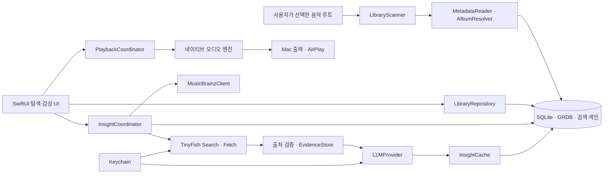

# Roon Alternative — Implementation Plan

작성일: 2026-10-01 (Asia/Seoul)
상태: 실행 전 계획. 요구사항은 [PRD.md](PRD.md)를 따른다.
현재 프로젝트에는 예시 음원과 이 계획 문서가 있으며 구현 코드·Git 저장소는 아직 없다.

## 1. 실행 원칙과 결정 사항

1. **원본 읽기 전용**: `/Volumes/Music1`과 예시 앨범은 이동·변환·태그 수정하지 않는다. DB와 파생 캐시는 내부 디스크에 둔다.
2. **재생 우선**: 스캔·정보 검색·LLM은 재생 경로와 분리한다. API 키가 없어도 기본 플레이어를 사용한다.
3. **네이티브 macOS**: SwiftUI + 필요한 AppKit 컴포넌트, AVFoundation/Core Audio, SQLite + GRDB를 기본으로 한다.
4. **엔진 확정은 Gate 0 이후**: AVQueuePlayer와 앱 내 AirPlay 선택을 우선 실험한다. Gapless/라우팅 조건에 따라 AVAudioEngine + 시스템 출력 경로를 비교한다.
5. **음악 엔티티 구분**: 파일·수록 트랙·녹음·작품·판·인물·참여 역할을 별도로 모델링한다.
6. **출처와 수정권**: 외부 값·로컬 값·사용자 수정값을 분리하고, 설명 생성이 정규 메타데이터를 덮어쓰지 못하게 한다.
7. **부분 조사와 실제 전체 규모 구분**: 확인한 6,819 파일은 부분 조사 결과다. 성능 시험용 100,000 트랙은 계획상의 부하 기준이다.

기본 지원 목표는 macOS 14+, Apple Silicon 우선이다. 배포용 OS 범위·Swift/Xcode·GRDB 버전은 Gate 0에서 호환성을 확인한 후 고정한다. 새 라이브러리/API 사용 단계에는 Context7과 공식 문서로 현행 인터페이스를 확인한다.

## 2. 현재 검토에서 확보한 증거

| 검사 | 결과 | 아직 증명하지 못한 것 |
| --- | --- | --- |
| 폴더 조사 | 7개 음악 섹션, Classic의 Artist/Composer 구조, CD 하위 폴더 | 전체 앨범 수·모든 형식의 비율 |
| 예시 태그 | 27곡, 24/96 stereo, 트랙별 ISRC, 디지털 UPC, 작곡자 누락 24곡 | 전체 컬렉션 태그 품질 |
| 임시 Swift 검사 | 27곡 모두 `isPlayable`; 각 8,192 frames 읽기; `AVRoutePickerView.player` API 컴파일 성공 | 실제 소리 출력·AirPlay·전곡 무결성·gapless·최소 OS |
| 외부 원문 | Warner의 판별 UPC, Qobuz의 트랙 크레디트 확인 | MusicBrainz/Discogs에서 이 판의 실제 매칭 성공 |
| API 정책 | MusicBrainz throttle, TinyFish Search/Fetch, Discogs 표시/캐시 조건 확인 | 사용자 계정의 API 접근·실제 사용 비용 |

이번 임시 진단 파일은 프로젝트 밖에서 실행 후 삭제했다. 앱을 만들거나 음악을 재생한 것으로 보고하지 않는다.

## 3. 아키텍처



- 하나의 앱 전체 PlaybackCoordinator가 오디오와 큐를 소유한다. 탐색 화면 선택과 현재 재생 ID는 별개다.
- LibraryScanner와 외부 작업 큐는 actor/service 경계로 분리한다. DB는 GRDB DatabasePool의 WAL을 이용해 읽기와 배치 쓰기를 분리한다.
- UI 갱신은 main actor, 파일 탐색·메타데이터·이미지 처리·네트워크는 백그라운드에서 수행한다. 긴 DB 트랜잭션이나 네트워크 작업을 main actor에 두지 않는다.
- 앱 자체 로컬 HTTP 서버는 사용하지 않는다. 공급원은 URLSession 어댑터로 연결하고 오디오 파일/절대 경로를 클라우드로 전송하지 않는다.
- PDF 열기와 AirPlay picker에 필요한 AppKit 연계만 좁게 둔다.

GRDB의 concurrent 읽기/WAL과 FTS 지원은 공식 문서 및 Context7에서 확인했다. [GRDB](https://github.com/groue/GRDB.swift), [FTS 문서](https://github.com/groue/GRDB.swift/blob/master/Documentation/FullTextSearch.md)

### 파일 구조 제안

```text
App/                     앱 진입점·씬·메뉴
Views/                   Sidebar · AlbumGrid · AlbumDetail · EntityDetail
Views/Playback/          PlaybackBar · Queue · OutputPicker
Views/Insights/          NowPlayingInspector · Sources · MatchReview
Models/                  LibraryRoot · Album · Track · Work · Artist · Credits
Stores/                  LibraryRepository · InsightRepository · SettingsStore
Services/Library/        Scanner · MetadataReader · AlbumResolver · FileAccess
Services/Playback/       Coordinator · AudioBackend · RouteMonitor
Services/Enrichment/     MusicBrainz · TinyFish · LLM · Matching · Evidence
Support/                 Unicode · SearchNormalization · Thumbnail · Logging
Database/                Schema · Migrations · SearchIndex
Tests/                   Library · Matching · Search · Enrichment · PlaybackState
script/                  build_and_run.sh · 배포/검증 도구
.codex/environments/     Run 버튼 환경
```

이 구조는 구현 때 생성한다. 한 파일에 UI·DB·재생·API 처리를 모으지 않는다. 앱 scaffold 시작 시 프로젝트 루트의 Git 상태를 다시 확인하고 저장소가 없으면 Git을 초기화한다. 예시 FLAC·커버와 실제 라이브러리, API 키, 캐시는 커밋 대상에서 제외한다.

## 4. 데이터 모델과 식별 규칙

| 엔티티 | 주요 필드/관계 |
| --- | --- |
| LibraryRoot | 안정적인 앱 ID, bookmark, volume identity 후보, 원본 경로, 상태, 제외 규칙 |
| Section | 루트, 원본 상대 폴더, 표시 이름, 순서, 숨김 |
| FileAsset | 앱 ID, 루트+원본 상대 경로, 크기/mtime, file resource ID 후보, 가용 상태, 원본 형식 |
| LocalAlbum | 앱 ID, 태그/폴더 후보, 표시 값, source folder 목록, Section 소속 |
| AlbumDisc | 앨범, 디스크 번호/제목; 박스 세트의 각 디스크 |
| Track | 앨범/디스크/순서, FileAsset, 길이, ISRC, local recording ID |
| Recording | 녹음 ID, 외부 MBID 후보, 재생 시간, 연주 크레디트 |
| Work | 작품 ID, 외부 MBID 후보, 제목·작품번호, 상위 작품/악장 관계 |
| RecordingWork | 녹음 ↔ 작품 다대다, 관계 유형, 매칭 근거 |
| Artist / ArtistAlias | 사람/단체 ID, 원래 이름, 승인된 별칭, 외부 ID, 정체성 상태 |
| Credit | 인물, 연결 대상 종류/ID, 역할, 악기, 출처; 다대다 |
| ExternalMatch | 로컬 대상, provider/entity/ID, 후보 score, 상태, 사용자 확정 여부 |
| FieldAssertion | 대상/필드/값, local/user/provider 출처, 조회일, 검증 상태 |
| Artwork / Attachment | 앨범 소속, 원본 경로 또는 내장 이미지 참조, 파생 캐시, 종류 |
| Evidence | 출처 URL/제목, 확보일, 필요한 인용 근거·hash·라이선스/만료 정책 |
| Insight | 대상 ID/종류, 언어, 설명, source IDs, model/prompt/schema 버전, 생성일 |
| ScanRun / EnrichmentJob | 실행 범위, 진행·실패·취소·재시도, 완료 상태 |
| QueueEntry | stable ID, Track ID, 순서, 마지막 위치 |

외부 Release/ReleaseGroup ID는 ExternalMatch에서 구분하며 LocalAlbum의 ID를 대체하지 않는다. 파일 사본·판·리마스터를 제목만으로 합치지 않는다. 연주자 클릭은 Credit을, 작곡자 클릭은 Work/Credit 및 로컬 작곡자 assertion을 조회한다. 관계가 없는 녹음을 추정으로 붙이지 않는다.

### 식별과 수정

- 실제 파일 URL/원본 상대 경로는 그대로 저장한다. NFC/NFKC·악센트 제거·case folding 값은 표시/검색 보조 컬럼에만 둔다.
- 파일 resource ID와 volume identifier의 가용성·안정성을 먼저 검증한다. 값이 없거나 불안정하면 앱 루트 ID + 정확한 상대 경로 + 크기/mtime를 사용한다.
- 이동 후보 판별은 짧은 fingerprint와 메타데이터를 보조로 사용하되 충돌 시 확인 후보로 남긴다. 전체 음원 hash를 기본 재스캔마다 계산하지 않는다.
- 수동 매칭/수정값은 별도 assertion으로 저장하며 자동 스캔보다 우선한다. 공급원 충돌은 원값을 보존한 채 검토한다.
- DB 백업은 WAL을 포함한 일관된 SQLite backup 방식으로 수행한다. 실행 중 DB 파일 하나만 복사하지 않는다. migration 실패 시 백업에서 복구한다.

## 5. 라이브러리 색인 설계

1. NSOpenPanel로 루트를 선택하고 지속 접근을 위한 bookmark를 저장한다. App Sandbox를 사용한다면 읽기 전용 선택 폴더 접근과 필요한 외부 통신 entitlement를 설정한다.
2. 숨김 파일, AppleDouble `._*`, 시스템/백업 폴더를 제외한다. 기본적으로 symlink 디렉터리를 따라가지 않아 루트 탈출·순환을 막는다.
3. 재귀 enumerate에서 파일 후보와 폴더 섹션을 먼저 기록한다. 진행 수치는 전체 수가 미확정이면 발견/처리 수로 표시한다.
4. FLAC STREAMINFO, Vorbis Comments, PICTURE를 읽는다. 오디오 디코딩은 Apple API에 맡기고 메타데이터 읽기만 분리한다.
5. 태그 키 대소문자/별칭, 반복 필드, `1/27` 등의 번호, 다중 참여자와 로컬 ID를 정규화한다. 불명확한 INVOLVEDPEOPLE 문자열은 raw 값도 보존한다.
6. 음악 파일이 있는 폴더에서 앨범 후보를 만든다. 동일 앨범/앨범 아티스트·disc 태그와 형제 CD 폴더를 이용해 다중 디스크를 묶는다. 이름만 같거나 태그가 충돌하면 자동 합치지 않는다.
7. 커버/부클릿을 해석하고 썸네일을 필요한 크기로 생성한다. 매우 큰 이미지의 full-resolution 메모리 적재를 피한다.
8. 작은 배치 트랜잭션으로 DB·검색 색인을 갱신한다. UI에는 확정된 결과부터 보여 준다.
9. 파일 가용성 정리는 루트가 연결되어 있고 해당 하위 범위의 enumerate가 성공한 경우에만 수행한다. 실패한 범위에는 이전 항목을 유지한다.
10. watcher는 변경의 힌트로 사용하고 시작/재연결/수동 reconciliation으로 보완한다. 재스캔 취소·앱 종료 후 이어서 처리할 수 있게 한다.

FLAC 메타데이터 reader는 범위를 제한한 읽기 전용 구현을 우선 검토한다. block 길이·개수·메모리 상한·잘린 파일을 검증하고 거대한 PICTURE를 UI에서 직접 로드하지 않는다. 다양한 태그/형식 지원 때문에 유지 비용이 커지면 Gate 0에서 검증한 외부 태그 라이브러리로 어댑터를 교체한다. 배포 앱이 Homebrew의 ffprobe/metaflac에 의존하게 만들지 않는다.

APE 및 단일 이미지+CUE는 발견·표시·미지원 보고까지 하고 v1에서 자동 변환하지 않는다. MP3의 태그·길이·재생을 별도로 검증한다. 향후 디코더는 번들·라이선스·제한된 PATH 검증을 거친다.

## 6. 재생·AirPlay 결정 게이트

| 후보 | 사용 목적 | 확인할 한계 |
| --- | --- | --- |
| AVQueuePlayer + AVRoutePickerView.player | 우선 후보: 로컬 트랙 큐와 앱 내 AirPlay 선택 | 실제 수신기 라우팅, 항목 전환 gap, 원격 seek/진행 위치 |
| AVAudioEngine + AVAudioPlayerNode | PCM scheduling으로 연속 전환·정밀 제어가 필요할 때 | AirPlay는 시스템 출력 경로를 우선 검증; 앱 전용 picker와 자동 결합한다고 가정 금지 |

Apple의 AirPlay 문서 중 `AVAudioSession` 예제는 iOS/tvOS/watchOS 대상이다. macOS 구현에 그대로 가져오지 않는다. [Apple AirPlay 문서](https://developer.apple.com/documentation/avfoundation/supporting-airplay-in-your-app), [AVQueuePlayer](https://developer.apple.com/documentation/avfoundation/avqueueplayer?changes=_7), [시스템 출력](https://support.apple.com/en-gb/guide/mac-help/-mchlp2256/mac)

PlaybackCoordinator는 `idle / preparing / playing / paused / buffering / failed`와 파일/출력 가용 상태를 관리한다. Command·UI·미디어 키는 같은 명령 경로를 사용한다. seek와 곡 교체에는 generation ID를 두어 지난 요청 completion이 새 곡 상태를 덮어쓰지 못하게 한다.

큐 전체를 전부 디코딩하거나 AVPlayerItem으로 만들지 않는다. 현재와 필요한 다음 항목만 준비한다. AVAudioEngine을 선택하면 다음 트랙의 PCM을 제한된 버퍼로 미리 준비하고 sample rate 변경 시 graph 재구성·drain·재시작을 명시적으로 처리한다.

**Gate 0 통과 조건:** 실제 Hi-Fi가 지원하는 경로에서 예시 FLAC 재생, seek, 다음/이전, 연결/해제, 30분 재생이 성공하고 재생 상태/출력 선택 UI가 일치한다. 로컬 연속 재생과 AirPlay 전환 gap을 별도로 기록한다. 연속 tone fixture로 로컬 출력의 추가 gap을 측정하고, AirPlay는 가능한 loopback/수신기 녹음과 청취 결과를 구분한다. 근거 없이 sample-accurate 또는 bit-perfect로 표기하지 않는다.

앱 내 picker가 해당 수신기에서 실패하면 시스템 AirPlay 출력으로 연결 가능성을 진단할 수 있지만, 이를 앱 단독 라우팅의 완료로 간주하지 않는다. 기본 제품 동작은 음악만 선택한 Hi-Fi로 보내고 Mac의 일반 소리·알림 경로를 유지해야 한다. Gapless 요구를 만족하지 못하면 엔진 교체·제품 제한을 명시적으로 결정한다.

## 7. 외부 메타데이터 매칭

매칭 순서는 기존 MBID → 판 UPC/barcode·레이블/카탈로그 → ISRC·트랙 순서/길이 → 앨범/연주자/발매일/트랙 목록 조합이다. ISRC는 단독으로 특정 앨범 판이나 작품의 고유 정답이 된다고 가정하지 않는다.

- 후보 점수에는 판별 identifier, 트랙 수, disc 구조, 제목, artist credit, 길이 차이 등을 반영한다. 점수는 초기 휴리스틱이며 정확도 확률로 표시하지 않는다.
- 자동 확정은 명시적 ID와 일관된 트랙 구조 등 강한 근거가 있고 경쟁 후보가 없을 때만 한다. 신규 발매·리마스터·제목 중복은 후보 상태를 유지한다.
- 길이는 보조 근거다. 다른 mastering의 차이 또는 공연 녹음 때문에 작은 차이를 무조건 거절하지 않는다.
- MusicBrainz의 Release/Recording/Work 관계로 작곡자·편곡자·연주자를 연결하되 빠진 관계는 빈 상태로 남긴다.
- MusicBrainz에 정보가 없으면 공식 페이지/해당 판 크레디트에서 근거를 확보해 **검토 가능한 후보**로 만든다. LLM 추출 값은 출처·판/트랙 일치 검사 없이 canonical graph에 들어가지 않는다.
- 태그와 외부 크레디트의 차이를 표시하고 앨범별 매칭 확정/해제/교체를 지원한다.

MusicBrainzClient는 통합 request queue로 초당 1회 이하를 유지하고 의미 있는 User-Agent를 설정한다. lookup과 search가 같은 제한을 공유하며 503/429는 bounded backoff로 처리한다. 네트워크 오류와 실제 no-result를 구분한다. negative cache TTL을 두고 최신 발매는 수동 재시도할 수 있게 한다. [MusicBrainz API](https://musicbrainz.org/doc/MusicBrainz_API), [Rate limiting](https://musicbrainz.org/doc/MusicBrainz_API/Rate_Limiting)

초기 샘플은 Mémoire와 각 섹션의 대표 앨범을 포함한 20–30개로 한다. 판 매칭·트랙 크레디트·작품 관계의 확인률을 따로 보고한다. 검색 결과가 없다는 이유로 신규 앨범을 다른 판에 붙이지 않는다.

## 8. TinyFish·LLM 설명 파이프라인

```text
현재 앨범/트랙의 stable ID
 → 유효한 설명 캐시 조회
 → 필요한 경우 MusicBrainz/기존 크레디트 확인
 → TinyFish Search로 공식/신뢰 가능한 자료 후보 발견
 → TinyFish Fetch로 필요한 원문 확보
 → entity·판·작품 일치 검사와 근거 선별
 → 제한된 근거를 LLM에 전달해 한국어 설명 생성
 → schema·source ID·주요 사실 검증
 → 원자적 캐시 저장
 → 같은 대상 ID를 표시 중인 패널에만 반영
```

### API와 요청 정책

- Search: `GET https://api.search.tinyfish.ai?query=...`, `X-API-Key` 인증. URL encoding을 사용하고 키를 URL/query에 넣지 않는다.
- Fetch: `POST https://api.fetch.tinyfish.ai`에 필요한 공개 URL을 보낸다. 반환 shape·부분 URL 실패·인증 조건은 구현 시 현행 문서/실제 계정으로 확인한다.
- Search 결과는 제목/URL/snippet 등의 후보로 정규화한다. Fetch 실패를 빈 자료로 성공 처리하지 않는다.
- 레이블·아티스트·확인 가능한 음악 기관 자료를 우선하고 불확실한 리뷰/의견은 출처의 견해로 구분한다.
- provider별 rate limiter, timeout, 취소, jitter backoff, 최대 재시도, 월 예산 예약을 둔다. 401/403/402는 설정 문제로 표시하고 반복 재시도하지 않는다.
- 유료 Web Agent/Browser는 기본 호출 경로에 넣지 않는다. 전체 음악 컬렉션 일괄 요약은 별도 범위/예산 액션이어야 한다.

[TinyFish Search reference](https://docs.tinyfish.ai/search-api/reference), [Fetch reference](https://docs.tinyfish.ai/api-reference/fetch-and-extract-content-from-urls)

### 생성과 캐시

- LLMProvider protocol로 제공자와 모델을 교체한다. 최초 실사용 버전은 하나의 실제 제공자만 완성하고 다른 제공자는 이후 추가한다. 계정/가격 선택은 구현 시 설정으로 해결한다.
- 응답은 `sections`, `claims`, `source_ids`, `uncertainties` 등의 제한된 schema를 사용한다. source ID는 실제 확보한 Evidence에만 연결되게 한다.
- 제목·연주자·발매·곡/작품의 범위를 명시한다. 일반 작품 설명을 특정 녹음의 특징으로 잘못 표현하지 않는다.
- 캐시 key는 대상 종류+stable ID+언어+근거 hash+model/prompt/schema 버전이다. 같은 작품 일반 설명은 녹음 간 재사용하고 특정 판/연주 설명은 별도 보관한다.
- deduplicate된 작업 큐를 사용한다. 다음 곡은 캐시 조회부터 하고 유료 prefetch는 옵션·예산 내에서만 한다.
- 원문이나 매칭이 바뀌면 기존 설명을 구버전으로 표시하고 재생을 막지 않는다. 출처 사용 조건과 만료 정책에 맞게 자료를 관리한다.
- 생성 취소·트랙 변경·늦은 응답을 테스트한다. 새 곡에 옛 곡 설명이 붙는 오류를 방지한다.
- 입력/출력 token과 예상 비용·확정 사용량을 구분해 기록한다. 예산 초과 시 새 유료 생성을 중단하고 기존 설명과 로컬 정보를 보여 준다.

### 자료와 비밀정보 경계

- 웹 원문은 데이터로 취급한다. 페이지 안의 지시가 파일 접근·명령 실행·키 노출·정규 메타데이터 수정으로 이어지지 않는다.
- 앱에는 음악 폴더 수정 도구나 자율 shell/브라우저 액션을 LLM에 제공하지 않는다.
- 내부 entity 링크는 타입과 ID를 검증한다. 외부 링크는 허용한 http/https만 열고 원격 HTML/script를 앱 권한으로 실행하지 않는다.
- API key는 Keychain, 로그는 redaction을 사용한다. 최소한의 공개 음악 메타데이터/선별 근거만 공급원으로 보낸다.
- 음원·부클릿 업로드는 기본 동작에 없다. 자동 수집 과정에서 로그인·paywall·CAPTCHA 우회를 하지 않는다.
- Discogs를 추가하면 6시간 이내 freshness와 attribution을 검사하는 별도 패널로 제공한다. 만료한 공급원 자료가 오프라인 패널·검색·요약에서 계속 표시되지 않게 한다. 처음에는 Discogs 기반 LLM 생성을 구현하지 않는다. [Discogs 약관](https://support.discogs.com/hc/en-us/articles/360009334593-API-Terms-of-Use)

## 9. 검색·이미지·성능

SQLite FTS5는 앨범/트랙/인물/작품 텍스트를 색인한다. `unicode61`과 diacritic 처리로 라틴 문자 검색을 개선하되 한국어·일본어 부분 검색은 별도 n-gram 보조 색인/정규화 조회로 검증한다. 단순 `%LIKE%` 전수 검색을 100,000 트랙의 주 경로로 삼지 않는다. [SQLite FTS5](https://www.sqlite.org/fts5.html)

- 쿼리 입력은 SQL parameter binding과 FTS query escaping을 적용한다. 사용자 입력을 원시 MATCH 구문으로 바로 넣지 않는다.
- 150–200 ms debounce, 제한된 결과, 취소 가능한 query를 사용한다. exact name/alias > prefix > 부분 일치 순서로 정렬한다.
- 섹션·role·format은 DB 필터로 적용하고 전체 데이터 로드 후 UI 필터링하지 않는다.
- 커버는 원본 전체가 아닌 downsampled 썸네일을 사용한다. 디스크 cache key는 source identity+변경 정보+target size로 만든다.
- 메모리 이미지 캐시 상한을 두고 grid 가상화/지연 로딩을 검증한다. 화면 밖 모든 커버를 동시에 decode하지 않는다.
- metadata reader concurrency는 외장 볼륨 I/O에 맞춰 작은 값으로 시작하고 계측 후 조정한다. 재생 중 scanner/enrichment 우선순위를 낮춘다.
- 10,000/100,000 트랙 synthetic DB와 실제 라이브러리를 구별해 측정한다. metadata DB 부하 시험을 실제 외장 디스크 성능 증거로 대체하지 않는다.

## 10. 단계별 작업과 통과 조건

| 단계 | 작업 | 완료 증거 | 예상 작업일 |
| --- | --- | --- | --- |
| 0. 기술 검증 | 실제 Hi-Fi, 엔진 비교, 최소 OS, 태그·권한·볼륨 검증 | 오디오/권한/메타데이터 결정 기록과 재현 결과 | 2–4 |
| 1. 색인 기반 | 앱 scaffold, DB migration, bookmark, 재귀 스캔, 앨범/디스크 묶기, 썸네일 | 예시 27곡·대표 폴더, 재스캔·재연결·원본 보존 | 5–8 |
| 2. 기본 감상 | 커버·트랙 화면, 재생 바·큐·seek·AirPlay·PDF·미디어 키 | 실제 Hi-Fi 30분 감상 및 오류 복구 | 5–8 |
| 3. 관계·검색 | 인물/작품 모델, 태그 기반 링크, FTS·다국어·필터 | 중복 제목·다중 credit·NFC/NFD·대규모 검색 | 4–6 |
| 4. 정확한 정보 | MusicBrainz, 후보 점수·검토 UI, 수동 override, 보완 자료 | 20–30앨범의 판/트랙/작품 확인률·오매칭 검증 | 5–8 |
| 5. 설명 기능 | TinyFish Search/Fetch, LLM 한 제공자, 출처·캐시·예산 | 앨범/연주자/작품 설명, 늦은 응답·오프라인·비용 시험 | 5–8 |
| 6. 실사용 검증·배포 | 실제 규모 성능, 장애 복구, gapless 결과, 앱 패키지 | 설치된 앱의 전체 시나리오·아티팩트·제한 기록 | 4–6 |

단일 개발자 기준 약 30–48 작업일, 즉 6–10주를 초기 추정으로 둔다. 이는 확약이 아니며 Gate 0의 엔진 변경·태그 다양성·라이브러리 규모에 따라 재산정한다. 1–2단계 완료 시 기반 버전을 사용할 수 있지만 전체 목표 완료는 3–6단계까지 필요하다.

### 단계 0의 구체적인 검증 순서

1. Hi-Fi 모델과 macOS에서 노출되는 출력 경로를 확인한다. 기존 시스템 AirPlay 재생이 가능하면 같은 경로를 최소 시험 앱에서 검증한다.
2. 예시 24/96과 CD 품질·다른 sample rate의 대표 FLAC을 재생하고 seek/출력 변경을 시험한다. 음원 변경 없이 fixture는 별도 임시 영역에서 준비한다.
3. `AVQueuePlayer`에서 연속 곡 전환을 측정하고, 필요하면 AVAudioEngine 방식을 비교한다. 확정된 엔진을 AudioBackend 어댑터로 구현한다.
4. 선택한 지원 OS에서 태그/내장 그림·bookmark 지속 접근·외장 볼륨 재연결을 확인한다. local network 권한/설명 항목은 실제 사용하는 Apple API 요구에 맞춘다.
5. 외부 DB의 샘플 coverage를 조사하여 신규 발매/없는 앨범의 fallback과 사용자 검토 범위를 정한다.

**실제 수신기 재생이 해결되기 전에는 전체 UI 구현을 시작하지 않는 것을 권장한다.** 나머지 오디오 외 검증은 그동안 진행할 수 있다.

## 11. 테스트와 출시 확인

구현을 그대로 따라 하는 테스트 대신 데이터 손실·오매칭·재생 상태·비용 경계에 초점을 둔다.

| 범위 | 의미 있는 검증 |
| --- | --- |
| 색인 | 누락 태그, 여러 CD, 같은 제목 다른 판, 손상 FLAC metadata, huge PICTURE, 읽기 실패, 중단/재개, symlink 순환 |
| 원본·재연결 | 대표 원본의 before/after hash·태그 비교, 볼륨 분리 중 rescan 후 보존, 같은 이름 다른 볼륨 오연결 방지 |
| 매칭 | Mémoire의 두 Impromptu, digital/CD UPC 구분, composer/arranger 구분, no-result·경쟁 후보·manual override 유지 |
| 검색 | Mémoire/Memoire, NFC/NFD 경로, 승인된 한/영 별칭, 일본어 부분 입력, FTS 특수문자, 섹션/role 필터 |
| 재생 상태 | 빠른 next/seek 반복, 파일 부재/손상, 오래된 completion 무시, 큐 변경·재시작·미디어 키 |
| 하드웨어 | 실제 Hi-Fi AirPlay 연결/제거/재연결, 30분 이상, sample rate 변경, gapless·출력 상태·재생 시각 검증 |
| 외부 서비스 | 401/402/403/429/503, 부분 Fetch 실패, malformed JSON, timeout/cancel, 중복 작업·예산·TTL |
| 정보 UI | 오래된 곡 응답 표시 방지, 출처 없는 claim 거절, AI 요약 표시, cache hit 무과금, 오프라인 사용 |
| 설치 앱 | Terminal PATH 없이 핵심 실행, bookmark 재시작, Keychain, 설치한 패키지의 동일 감상 시나리오 |

네트워크 단위 테스트는 저장한 최소 응답 fixture를 사용하고 유료 API를 CI에서 반복 호출하지 않는다. 실제 API 소규모 smoke test와 실제 하드웨어 시험은 별도 결과로 기록한다.

배포는 로컬 `.app`/선택적 DMG부터 시작한다. 서명·entitlement·Gatekeeper·최소 OS를 검사하고, 로컬 ad-hoc 서명과 Developer ID/notarization을 구분해 결과를 적는다. 공개 배포를 전제로 계정·인증서 구매를 요구하지 않는다. 사용자 환경에서 설치된 앱으로 검증하기 전에는 빌드 성공만으로 완료를 선언하지 않는다.

## 12. 주요 리스크와 대응

| 리스크 | 조기 발견/대응 |
| --- | --- |
| 실제 Hi-Fi의 앱별 AirPlay 제약 | Gate 0 우선; 시스템 출력 경로와 비교 |
| gapless·라우팅이 같은 엔진에서 만족되지 않음 | 초기 측정 후 엔진 결정; 두 엔진 운영은 필요성이 증명될 때만 |
| 클래식 태그 누락/동명이곡 | 역할·작품/녹음 분리, 트랙 구조·ID·출처, 검토 가능한 후보 |
| 박스 세트/태그 불일치 | 다중 폴더 모델, 자동 묶기 보수화, 앱 DB 수정 |
| 외장 볼륨 분리·부분 스캔 실패 | 가용 상태와 삭제 분리, 성공 범위 reconciliation |
| 신규 발매의 외부 DB 누락 | 로컬 우선, 공식 자료 보조, no-result TTL과 재시도 |
| API 정책/비용 변경 | provider adapter·rate limiter·TTL·예산, 기본 기능 offline |
| Discogs 장기 캐시와 정책 충돌 | 필수 의존성 제외, 도입 시 별도 만료 표시 정책 |
| LLM 오정보·느린 응답 | 근거 제한·source schema·사실 검증·캐시, 재생 독립 |
| 성능 저하 | DB paging·썸네일·제한 concurrency, 실제/synthetic 계측 구분 |

다음 실제 구현 작업은 **Gate 0: 네이티브 FLAC + 실제 Hi-Fi AirPlay 최소 검증**이다. 이 문서 작성으로 앱 구현이 시작되거나 완료된 것은 아니다.

## 13. 설정 문제 수정 (2026-10-03)

- 음악 폴더 연결 제거: 원본은 보존하고 해당 색인·관계·검색·큐를 트랜잭션으로 정리한다. 스캔 취소 완료를 기다린 후 제거하고 나머지 폴더의 스캔을 재개한다.
- 설정 저장 성공 시 설정 창을 닫고, 실패 시 오류를 표시하며 창을 유지한다.
- TinyFish와 모델 키 입력칸을 명확히 표시하고 저장 상태·Keychain 접근 오류를 구분한다. 전체 설정 저장에 입력한 키를 포함하고 TinyFish 검색 연결 확인을 제공한다.
- 폴더 제거·공유 관계·큐·스캔 취소의 회귀 검사, SwiftPM 빌드, 설치 앱에서 입력칸·저장 후 닫힘·스캔 중 저장을 검증한다.

## 14. X100 출력 문제 점검 (2026-10-03)

- Mac의 기본 출력·음소거·Core Audio 장치, Bonjour 광고, LAN 도달성, AirPlay 연결 로그를 비교한다. 목록 검색과 실제 연결 성공을 구분한다.
- 오디오 전용 AirPlay 상태는 Core Audio transport·UID·가용 상태로 확인한다. 비디오 전용 external playback 상태로 오디오 연결 여부를 판단하지 않는다.
- 정상적인 출력 선택은 재생을 유지하고, 사용자가 선택하지 않은 출력 손실은 일시 정지한다. 시스템 설정을 여는 동작에는 장치 교체 시간을 허용한다.
- 현재 출력 이름·경로·장치 sample rate를 표시하고 시스템 출력으로 돌아가는 동작을 제공한다. 원본 24/96과 실제 AirPlay 전송 형식은 구분한다.
- 출력 전환 회귀 검사, 설치 앱에서 X100 시스템 경로와 앱 picker 비교를 수행한다. 물리적 청취·장시간 안정성은 실제 확인한 범위까지만 기록한다.
- 실제 비교 결과, AVPlayer 연결 유무와 무관하게 앱 native picker의 X100 연결은 실패했다. 시스템 사운드 설정으로 연결한 X100에서는 우리 앱의 Dream 2 소리를 사용자가 확인했다. 이때 시도한 시스템 설정 기반 UI는 15절의 앱 단독 출력 요구에 따라 철회한다.

## 15. 앱 단독 오디오 출력 (2026-10-03)

- 사용자 지적에 따라 14절의 시스템 출력 경로는 임시 진단 결과로 정정한다. 다른 앱·시스템 알림을 Hi-Fi로 보내는 것을 정상 기본 동작으로 제공하지 않는다.
- 라이브러리·Keychain을 사용하지 않는 작은 진단 앱에서 Core Audio UID 지정과 native picker를 비교한다. FLAC 파일과 파생 AAC 파일의 차이를 확인하며 원본은 수정하지 않는다.
- 성공 기준은 Mac의 기본 출력과 알림 출력이 내장 스피커에 유지된 상태에서 앱의 음악만 X100으로 재생되는 것이다. HAL 장치가 사라지는 것과 앱 연결 실패를 구분한다.
- 이 조건을 실제 확인한 경로만 제품에 반영한다. 시스템 출력으로의 자동 우회와 성공 표시는 제거하고, 아직 해결되지 않은 경우 정확한 실패 단계와 남은 작업을 기록한다.

## 16. X100 조사 중단 및 인계 기록 (2026-10-03)

- 사용자의 중단 요청 이후 연결 시험을 종료했다. 앱 단독 X100 연결은 미해결이며 시스템 출력 우회 UI는 철회했다.
- 실패한 실험·확인 사실·가설·미실행 해결책은 [X100 조사 기록](/Volumes/Aquatope/_DEV_/Roon_Alternative/docs/x100-airplay-investigation-2026-10-03.md)에 남긴다. 특히 직접 RAOP 제어 세션 성공과 실제 청취 성공을 구분하고, ALAC 비교는 준비됐지만 실행되지 않았음을 명시한다.
- 향후 작업은 사용자 재개 요청 이후 정상 Apple Music 경로 비교 → native macOS 세션 설정 확인 → 필요한 경우 통제된 ALAC/PCM 비교 → 실제 성공한 경로의 제품 통합 순서로 검토한다. 이 계획 기록 자체는 시험 재개를 의미하지 않는다.
